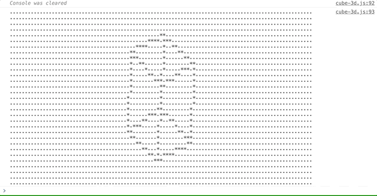

# **Text Canvas JS**

A canvas for rendering whatever with characters in JavaScript.

## Install

In the browser just load the file `text-canvas.js` in a `script` tag at the bottom of its `body`.

```html
<body>
    ...
    <script src="text-canvas.js">
    <!-- your scripts using text-canvas.js here -->
</body>
```

In node just install the package `text-canvas.js` and require (or import) it in your module.

```sh
$ npm i text-canvas.js
```

```js
var TextCanvas = require('text-canvas.js');

// or import it (e.g. in React, Vue... whatever)
import TextCanvas from 'text-canvas.js';
```

## Use

Demo code:

```js
// create a canvas
var canvas = TextCanvas(30, 30);

// clear it with yellow hearts
canvas.clear('💛');

// paint a rectangle of 10 x 10 located at position (10, 10) with purple hearts
canvas.rect(10, 10, 20, 10, '💜');
canvas.rect(20, 10, 20, 20, '💜');
canvas.rect(10, 20, 20, 20, '💜');
canvas.rect(10, 20, 10, 10, '💜');

// paint a clown with a baloon
canvas.dot(14, 15, '🎈');
canvas.dot(15, 15, '🤡');

// render in the console
console.log(canvas.toString());
```


**SEE*** animated demo `cube-3d.js` by running `index.html` in the browser.



\* **NOTE** for 3D processing this demo is using [`m.js`](https://www.npmjs.com/package/m.js). 