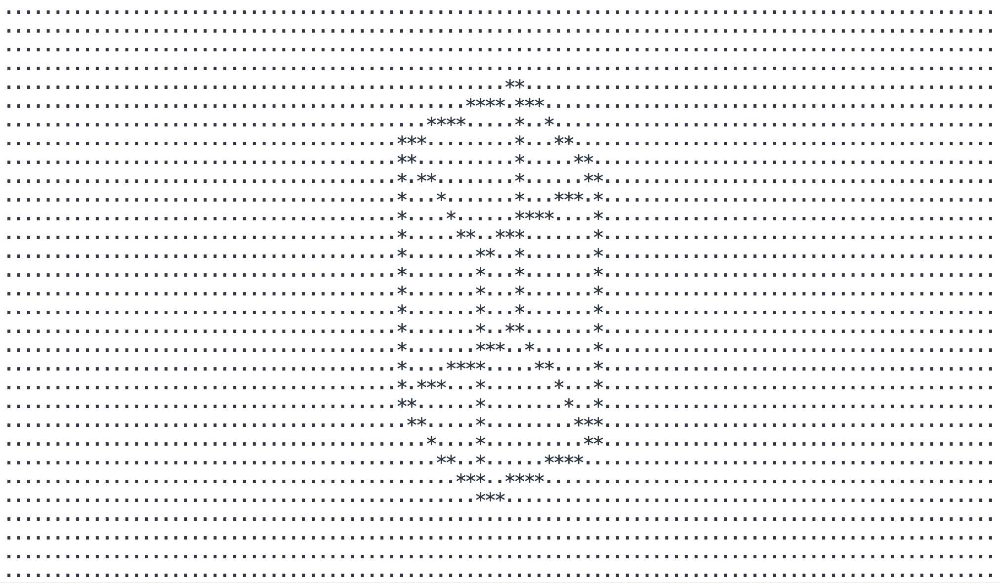
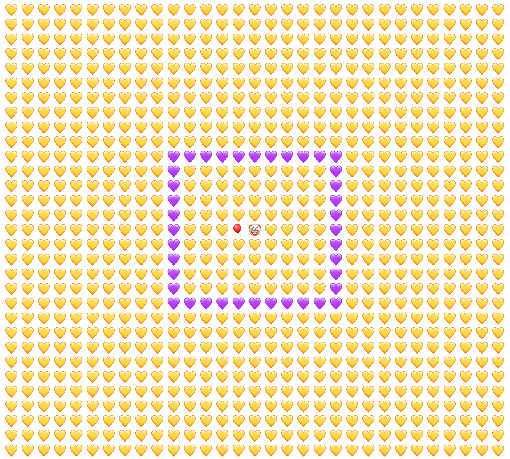

# **TextCanvas.js**

A canvas for rendering whatever with characters.

## Intall

In the browser just load the file `text-canvas.js` in a `script` tag at the bottom of its `body`.

```html
<body>
    ...
    <script src="text-canvas.js">
</body>
```

In node just install the package `text-canvas.js` and require (or import) it in your module.

```sh
$ npm i text-canvas.js
```

```js
var TextCanvas = require('text-canvas.js');

// or import it (e.g. in React, Vue... whatever)
import TextCanvas from 'text-canvas.js';
```

## Demo code

```js
// create a canvas
var canvas = TextCanvas(30, 30);

canvas.clear('💛');

// paint a rectangle of 10 x 10 located at position (10, 10)
canvas.rect(10, 10, 20, 10, '💜');
canvas.rect(20, 10, 20, 20, '💜');
canvas.rect(10, 20, 20, 20, '💜');
canvas.rect(10, 20, 10, 10, '💜');

// render in the console
console.log(canvas.render());// create a canvas
```



**SEE** animated demo `cube-3d.js` by running `index.html` in the browser.